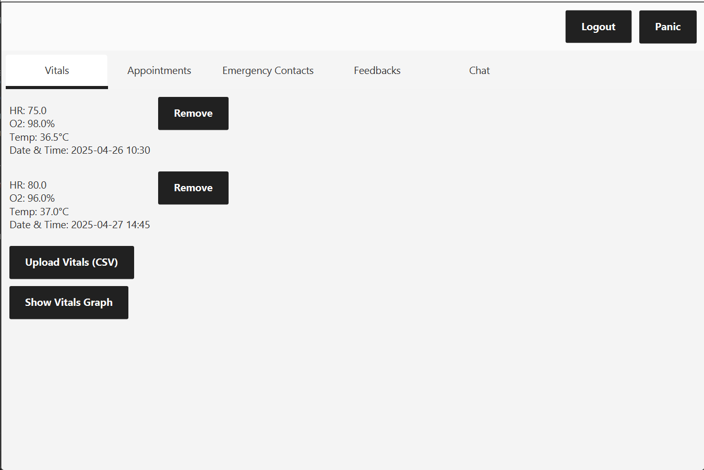

# Remote Patient Monitoring System (RPMS)

## Overview

RPMS is a comprehensive healthcare management system designed to facilitate remote patient monitoring, appointment scheduling, and communication between doctors and patients. The system provides a robust platform for healthcare professionals to track vital signs, schedule appointments, conduct video consultations, and maintain patient records.

## Features

- **Multi-User System**: Separate interfaces for Patients, Doctors, and Administrators
- **Vital Signs Monitoring**: Track patient health data with automated alerts for critical values
- **Appointment Management**: Schedule, approve, and manage medical appointments
- **Video Consultation**: Request and conduct virtual meetings between doctors and patients
- **Real-Time Chat**: Secure messaging system between healthcare providers and patients
- **Emergency Alert System**: Panic button functionality to notify emergency contacts
- **Prescription Management**: Doctors can provide digital prescriptions and feedback
- **Comprehensive Reporting**: Generate and download patient health reports

## Technology Stack

- **Backend**: Java (JDK 17)
- **Frontend**: JavaFX
- **Build System**: Maven
- **Dependencies**: Jakarta Mail, Jakarta Activation

## Installation

### Prerequisites

- Java Development Kit (JDK) 17 or higher
- An IDE that supports Java (VS Code, IntelliJ IDEA, Eclipse)

### Setup Instructions

1. Get the project:
   - **Option 1**: Clone the repository:
     ```bash
     git clone https://github.com/alapg09/RemotePatientMonitoringSystem.git
     ```
   - **Option 2**: Extract from the provided ZIP file

2. Open the project:
   - Open your preferred IDE
   - Select "Open" or "Import" project
   - Navigate to the extracted/cloned rpms directory
   - Select the project folder and open it

3. Configure the project:
   - **Option 1**: Using Maven (recommended)
     - Install Maven if not already installed
     - Use chatgpt or follow any youtube video to install because you have to add the path to environment variables.
     - Brief steps are listed as follows
     1. **Download Maven**:
   - Download latest binary zip from [Apache Maven website](https://maven.apache.org/download.cgi)

    2. **Extract Files**:
   - Extract to a directory without spaces (e.g., `C:\Programs\Maven`)

    3. **Set Environment Variables**:
   - Create system variable `MAVEN_HOME` pointing to installation directory
   - Add `%MAVEN_HOME%\bin` to `Path` variable

    4. **Verify Installation**:
   - Open new command prompt
   - Run `mvn -version` to confirm successful installation
     - In the terminal or IDE's Maven panel, run:
       ```bash
       mvn clean install
       ```
     
   - **Option 2**: Without Maven
     - Add the following JAR files to your project's build path:
       * javafx-controls-21.0.7.jar
       * javafx-fxml-21.0.7.jar
       * javafx-graphics-21.0.7.jar
       * jakarta.mail-1.6.7.jar
       * jakarta.activation-1.2.2.jar
       * (All JAR files are included in the 'lib' folder)

4. Run the application:
   - **With Maven**: Run `mvn javafx:run`
   - **Without Maven**: Run the Main class (com.rpms.Main)
     - Add VM arguments if needed: `--module-path "path\to\javafx\lib" --add-modules javafx.controls,javafx.fxml`


## Demo Video (Google Drive Link)
https://drive.google.com/drive/folders/1M8ipYnAI6k8LeqD9CgckuM_L1npaJnpu?usp=drive_link


## Usage

### Login Credentials

The system comes with pre-configured sample accounts:

- **Doctor**:
  - Username: kshabbir.doc
  - Password: kshabbir123

- **Patient**:
  - Username: akhan
  - Password: akhan123

- **Administrator**:
  - Username: agohar.adm
  - Password: 502082.default.adm

### Administrator Functions

- User management (add/remove doctors, patients, and administrators)
- View system logs
- Monitor system activity

### Doctor Functions

- View and manage assigned patients
- Monitor patient vital signs with visualizations
- Approve or reject appointment requests
- Schedule video consultations
- Provide medical feedback and prescriptions
- Chat with patients

### Patient Functions

- Upload vital signs data (manual or CSV)
- Request appointments with doctors
- View scheduled video consultations
- Access prescription history
- Manage emergency contacts
- Chat with assigned physician
- Activate panic button in emergencies

## Data Management

The system stores data using Java serialization. All data is automatically saved to the `data/` directory, including:

- User accounts
- Patient vital signs
- Appointment records
- Chat histories
- System logs

## Troubleshooting

### Common Issues

- **JavaFX Configuration Warning**: If you see "Unsupported JavaFX configuration: classes were loaded from unnamed module", the application will still function correctly.

- **Port In Use Error**: The chat server automatically tries alternative ports if the default port (12345) is in use.

### Resolving Problems

1. For build issues:
   ```bash
   mvn clean